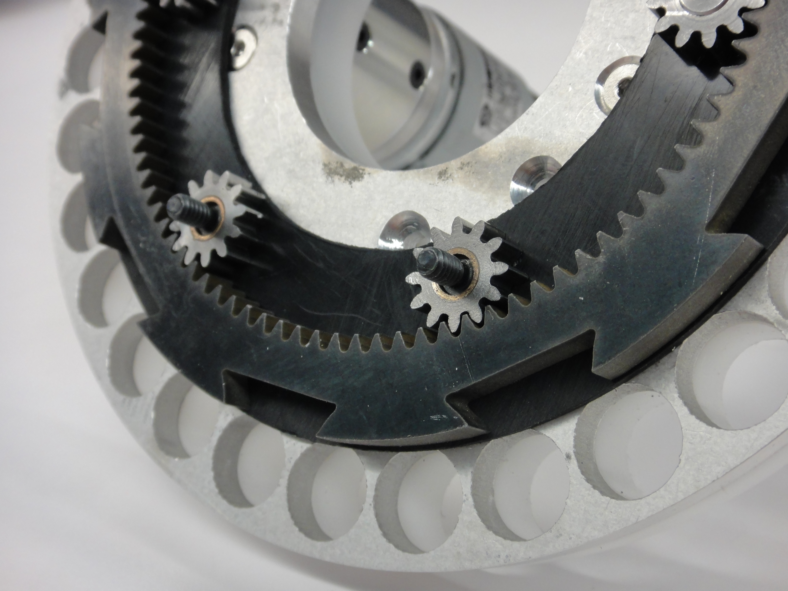

## Project Overview
Built out of a Vibraphone, Vibratron played was a robotic instrument that used recirculating ball bearings to hit keys on a circularly re-constructed vibraphone. This instrument was part of the Robotics club RobOrchestra.

## Team Members
Andrew Burks!

## Contributions
### Aesthetic Design

### The distributor

### The lift

