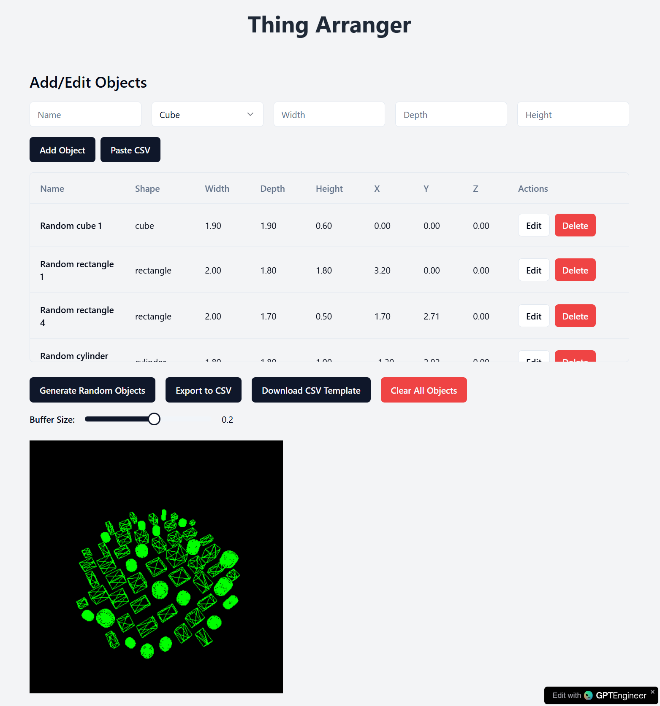

*This post mostly brought you by AI*

### Thing Arranger: A Tool for Aesthetic Object Placement and 3D Printing

Ever had a bunch of random objects that you just couldn’t figure out how to arrange in a pleasing way? Or perhaps you wanted to create something that looked like organized chaos but didn’t want to spend hours manually placing each object in just the right spot? Enter **Thing Arranger**, a Python tool that arranges objects in aesthetically interesting ways, generating 3D models ready for printing.

#### Demo Time

Made in approximately 22 iterations with GPTEngineer... no code, just prompt.
[aesthetic-arranger](https://aesthetic-arranger.gptengineer.run/)

Still some issues to work out, but overall blown away by how well this worked.

#### How It is Supposed to Work

**Thing Arranger** takes a collection of objects—defined by their 2D footprint and height—and arranges them based on specific rules. The output? A file format ready for 3D printing, like a Parasolid or STL file.

Here’s a breakdown of the key steps:

#### 1. Footprint Arrangement
First, Thing Arranger tackles the layout of the objects from a top-down perspective, placing each object's footprint. It starts with the largest object to anchor the arrangement.

From there, the objects are placed from largest to smallest, hugging the first object as closely as possible. There’s a buffer you can define—how much space each object should leave around it—ensuring they don’t collide and giving some control over the final layout. If you want everything centered, the first object can start in the middle. Prefer things off to one side? No problem. Set an envelope boundary, and the tool will start positioning objects along an edge like a well-behaved interior decorator.

#### 2. TODO: Height Setting
Once the objects are arranged in 2D space, Thing Arranger tackles their vertical positioning. Instead of placing objects at arbitrary heights, the tool allows you to define a "finished height" for the top of each object. Here's where it gets interesting: the further an object is from the starting one, the lower its height. This creates a gradual slope effect, with everything cascading down from that first anchor object. You get this neat, organized flow where all objects seem to descend from a focal point.

#### 3. TODO: Pedestal Creation
But what’s a set of beautifully placed objects without some support? Thing Arranger doesn’t just drop your objects onto a flat plane. It builds pedestals for each object, connecting them all together. Think of it as creating an intricate display stand that becomes part of the design itself. The pedestals are generated based on the object positions and heights, ensuring they are not just floating in space but supported by a solid, printable structure.

Once all this is done, you can export your finished arrangement as a 3D model, ready to be printed and admired.

#### Why Use Thing Arranger?
If you’re into 3D printing or design, Thing Arranger could save you tons of time when it comes to creating organized, visually appealing arrangements. Whether you’re working with sculptures, trinkets, or even abstract shapes, this tool takes away the guesswork of arranging things manually and offers a unique way to create cohesive designs. 

The best part? It’s customizable. Want a tight cluster of objects centered on a pedestal? Done. Looking for a sprawling design where the objects gently slope down towards the edges? Thing Arranger has you covered.

It’s the ultimate utility for anyone looking to turn chaos into something worth printing.